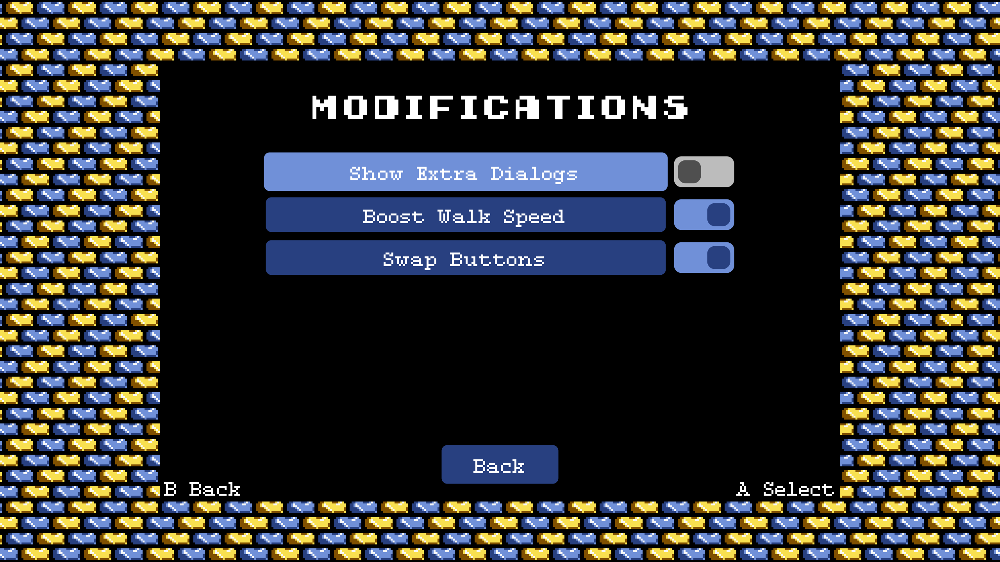
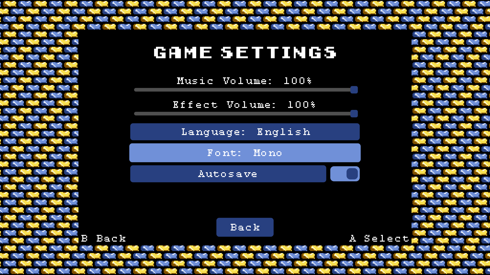

# Links Awakening DX HD

This is a personal fork of [Link's Awakening DX HD](https://linksawakeningdxhd.itch.io/links-awakening-dx-hd).

Check the [wiki](https://github.com/ihm-tswow/Links-Awakening-DX-HD/wiki) for a brief documentation of the in-game tools.

## Build

**Prerequisites**

- (Very) Basic knowledge of C# and Visual Studio
- [Visual Studio 2022](https://visualstudio.microsoft.com/downloads/)
    - Make sure to select `.NET desktop development` components in the visual studio installer.
- .NET 6.0 SDK

**Build Instructions**

- Clone this repository
- Open ProjectZ.sln
- Build/run like any normal C# program
    - To create an optimized release build, run the `publish.bat`, or the Publish action in Visual Studio, to output a `Publish` folder.

## Changes

### New Mods menu!

#### Show Extra Dialog

Show or hide the Piece of Power / Guardian Acorn / Heavy Object dialogs that persistently pop up. Inspired by this [QoL Patch](https://www.romhacking.net/hacks/3597/) for the GBC DX version.

Default value is `ON`.

#### Boost Walk Speed

Set Link's base speed to 1.25x normal. Makes map traversal feel better without overdoing it.

Default value is `OFF`.

#### Swap Button Layout

Default layout and UI actions (confirm and cancel) use XInput. This option will swap to the "other" layout, along with swapping the location of the confirm and cancel buttons.

Default value is `OFF`.

### Font Selection!

Available in the Game Settings menu, choose between the original font or a monospace version for more clarity in menus and dialogs.

The monospace version was in the original release, but went unused.

### Other Enhancements and Fixes!

- Quit menu for easy exiting of the application - [@dekart811](https://github.com/dekart811)
- Adjust gameplay scaling using the L and R bumpers - [@malmazuke](https://github.com/malmazuke)
- Performance optimizations to help on lower end devices and running via emulation
- [WIP] Additional Languages (credited by Git history):
    - Spanish - [@edaznaran](https://github.com/edaznaran)
    - Portuguese - [@altiereslima](https://github.com/altiereslima)
    - Italian - [@mattiabrognoli](https://github.com/mattiabrognoli)
    - Ukrainian - [@k3kukua](https://github.com/k3kukua)
    - Russian - [@Dima353](https://github.com/Dima353)

## Credits

TODO
